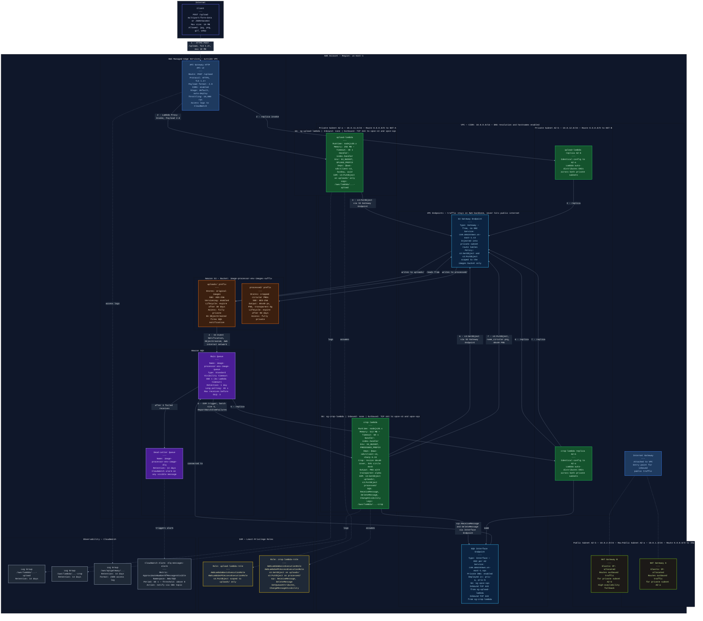

# Proyecto: Procesador de Imágenes en AWS con Terraform

En este repositorio he creado todo el código necesario para levantar mi propia arquitectura Serverless en AWS, la cual procesa imágenes automáticamente. Todo lo he hecho usando Terraform.

## Herramientas y Servicios que Utilicé

**Mis Herramientas:**
- **Terraform:** Lo utilicé para desplegar toda la infraestructura como código (IaC).
- **AWS CLI:** Lo uso para conectarme y gestionar los servicios directamente desde mi terminal.

**Servicios de AWS:**
- **API Gateway (HTTP API v2):** Lo configuré como mi punto de entrada público para recibir las peticiones.
- **AWS Lambda:** Aquí puse toda mi lógica de negocio sin usar servidores. Creé dos funciones: `upload-lambda` (para recibir mi imagen) y `crop-lambda` (para recortarla con forma circular).
- **Amazon S3:** Es mi almacenamiento. Configuré el prefijo `uploads/` para guardar mis imágenes originales y `processed/` para las que ya están recortadas.
- **Amazon SQS:** Es mi cola de mensajes principal. También le agregué una Dead-Letter Queue (DLQ) para desacoplar el proceso y manejar mis errores de forma segura.
- **Amazon VPC:** Hice que toda mi arquitectura corra dentro de una red privada usando subredes, NAT Gateways y VPC Endpoints (así me aseguro de que el tráfico de mis servicios S3 y SQS no salga a internet público).

## Mi Diagrama de la Arquitectura

He preparado mi proyecto para que pueda desplegarse en 3 entornos totalmente separados: **DEV**, **QA** y **PROD**. Para lograr esto, utilizo los `workspaces` de Terraform.

Aquí dejo el diagrama exacto que armé con todos los componentes y cómo los conecté:



## Mi Estructura del Proyecto

Así es como organicé mis carpetas y archivos:

```text
IAC_Semana04/
├── .gitignore
├── README.md
├── architecture.mermaid
├── assets/
│   └── mi_foto_perfil.png
├── iac/
│   ├── api_gateway.tf
│   ├── cloudwatch.tf
│   ├── endpoints.tf
│   ├── iam.tf
│   ├── lambda_crop.tf
│   ├── lambda_upload.tf
│   ├── nat.tf
│   ├── outputs.tf
│   ├── providers.tf
│   ├── route_tables.tf
│   ├── s3.tf
│   ├── security_groups.tf
│   ├── sns.tf
│   ├── sqs.tf
│   ├── subnets.tf
│   ├── terraform.tfvars.example
│   ├── variables.tf
│   └── vpc.tf
└── src/
    └── lambdas/
        ├── crop/
        │   ├── index.mjs
        │   └── package.json
        └── upload/
            ├── index.mjs
            └── package.json
```

## Pasos que sigo para Desplegar

**1. Loguearme en AWS (SSO)**
Antes de hacer nada, necesito tener mi sesión de AWS activa. En mi terminal ejecuto:
```bash
aws configure sso --use-device-code
```
Sigo el enlace, pongo mi código, selecciono mi cuenta, elijo el rol, la región y le asigno un nombre a mi perfil.

**2. Configurar mi archivo de variables**
Copio el archivo de ejemplo y coloco mis datos reales (como el ID de mi cuenta de AWS y mi región):
```bash
cp iac/terraform.tfvars.example iac/terraform.tfvars
```

**3. Inicializar Terraform**
Entro a mi carpeta de infraestructura y la inicializo:
```bash
cd iac
terraform init
```

**4. Levantar mi entorno**
Dependiendo de qué entorno necesite crear, ejecuto los comandos correspondientes. 

Para **DEV**:
```bash
terraform workspace new dev
terraform plan -var-file="terraform.tfvars"
terraform apply -var-file="terraform.tfvars" -auto-approve
```

Para **QA**:
```bash
terraform workspace new qa
terraform plan -var-file="terraform.tfvars" -var="environment=qa"
terraform apply -var-file="terraform.tfvars" -var="environment=qa" -auto-approve
```

Para **PROD**:
```bash
terraform workspace new prod
terraform plan -var-file="terraform.tfvars" -var="environment=prod"
terraform apply -var-file="terraform.tfvars" -var="environment=prod" -auto-approve
```

## ¿Cómo pruebo que mi proyecto funciona?

Suelo probarlo de dos maneras distintas:

**Opcion A: Vía Consola S3 (Manual)**
Subo manualmente una imagen a la carpeta `uploads/` de mi bucket S3. Espero un par de segundos y verifico que aparezca mi versión procesada en la carpeta `processed/`.

**Opción B: Vía API / Terminal**
Cuando termino el despliegue de Terraform, me devuelve la URL de mi API (`api_url`). Subo mi foto directamente desde la terminal con curl:
```bash
curl -X POST <URL_DEL_API> \
  -H "Content-Type: image/png" \
  --data-binary "@../assets/mi_foto_perfil.png"
```

## Mis Requisitos de Entrega (Archivo PDF)

Para completar la entrega de mi proyecto, debo subir un archivo **PDF** que incluye:
- Capturas de pantalla de mi consola de AWS mostrando que mis servicios están desplegados (asegurándome de que en las capturas se vea el ID de mi cuenta).
- La URL pública de mi proyecto y un pequeño resumen explicando cómo la uso (basándome en este README).
- **Evidencia de limpieza:** Esto es obligatorio para mí. Adjunto mis capturas ejecutando los comandos de destrucción (`terraform destroy*`) para demostrar que eliminé mis recursos correctamente.

## ¡Importante! Limpiar mis recursos

Para que no me cobren nada en AWS (sobre todo por los NAT Gateways), me aseguro de destruir todo apenas termino de probar. 

*Aviso: Antes de lanzar mi comando de destroy, entro a mi consola de S3 y vacío mi bucket manualmente, porque Terraform falla si intento borrar un bucket que todavía tiene archivos adentro.*

Mis comandos para destruir todo (elijo el entorno en el que estaba trabajando):

```bash
# Si estaba en DEV
terraform workspace select dev
terraform destroy -var-file="terraform.tfvars" -auto-approve

# Si estaba en QA
terraform workspace select qa
terraform destroy -var-file="terraform.tfvars" -var="environment=qa" -auto-approve

# Si estaba en PROD
terraform workspace select prod
terraform destroy -var-file="terraform.tfvars" -var="environment=prod" -auto-approve
```
